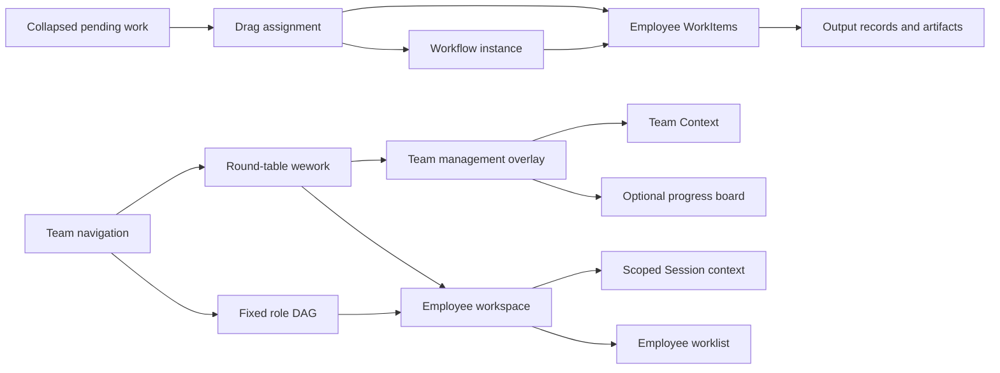
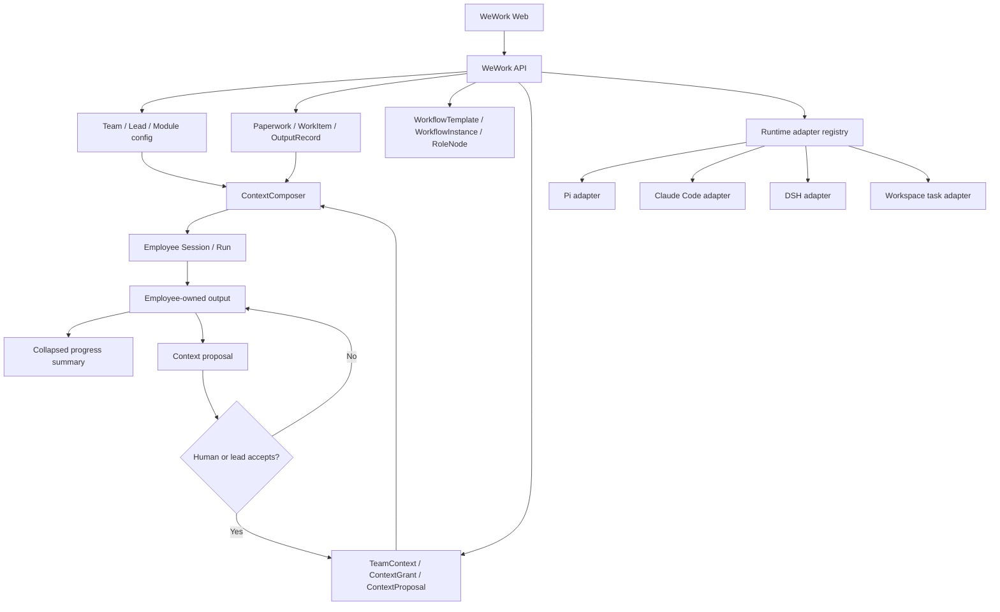
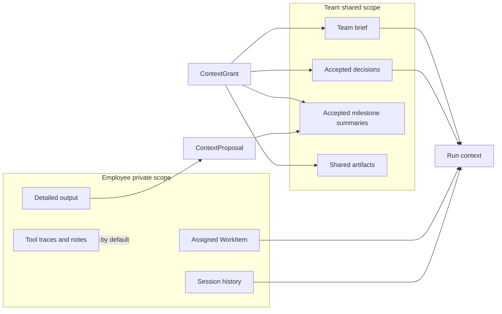

# WeWork Overall Plan

## Product Surface

## Runtime and Context Architecture

## Context Boundary

## Delivery Sequence

1. **Interaction validation**: quiet desktop layout, round-table navigation, collapsible pending work, and drag assignment.
2. **Team foundation**: templates, first employee, lead invariant, TeamContext, module providers.
3. **Runtime registry**: per-employee Pi/Claude Code/DSH adapters and capability negotiation.
4. **Pending-work distribution**: Paperwork/Digital metadata, direct WorkItems or role-DAG WorkflowInstances, ContextGrant, ContextComposer, and employee worklists.
5. **Progress and responsibility**: OutputRecord, collapsed board summaries, detail expansion, reviews.
6. **Handoff**: work reassignment, context package, successor verification, offboarding.
7. **External modules**: provider adapters for existing boards/context systems plus built-in lightweight implementations.

## Prototype Boundary

- Desktop only.
- No group chat, team completion percentage, or permanent progress dashboard.
- Pending work is collapsed by default and expands only for assignment.
- A team may use either round-table collaboration or a fixed role-DAG as its main view.
- Paperwork and Digital are metadata in one pending-work flow.
- Runtime state must come from a real adapter; unavailable adapters remain visibly unconfigured.
- Team management and employee detail open on demand instead of occupying permanent page columns.
